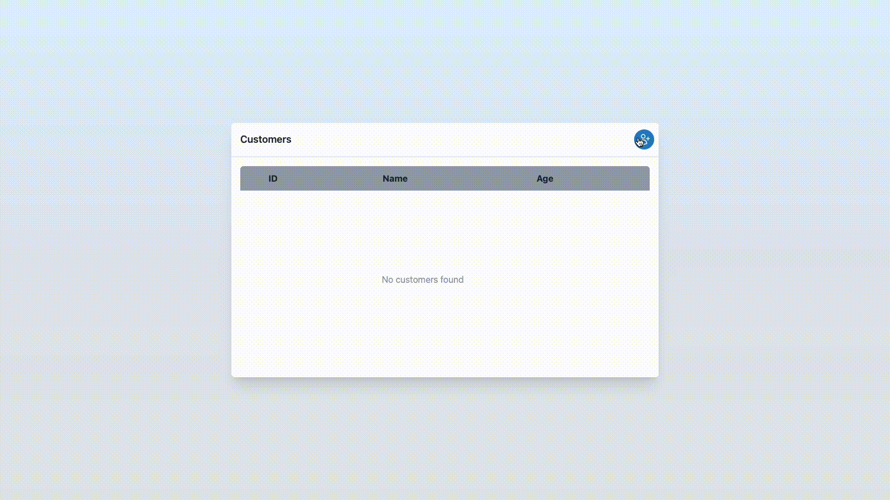

<h4 align="center">
📝 CRUD Next 📝
</h4>

<hr>

<p align="center">
  <a href="#dart-about">About</a> &#xa0; | &#xa0;
  <a href="#sparkles-features">Features</a> &#xa0; | &#xa0;
  <a href="#computer-technologies--requirements">Technologies & Requirements</a> &#xa0; | &#xa0;
  <a href="#clapper-show-off">Show Off</a> &#xa0; | &#xa0;
  <a href="#checkered_flag-starting">Starting</a> &#xa0; | &#xa0;
  <a href="#memo-license">License</a> &#xa0; | &#xa0;
  <a href="#gem-deploy--repository">Deploy & Repository</a> &#xa0; | &#xa0;
  <a href="https://github.com/KayoRenato" target="_blank">Author</a>
</p>

<br>

## :dart: About ##

I create this project to practice fundamental concepts of Hooks like useContext,
 useState, and UseEffect in a CRUD basic with integration on Firestore.

## :sparkles: Features ##

:ballot_box_with_check: Create and edit customer exploring useContext and useState;  
:ballot_box_with_check: List Customers exploring useEffect and useState;  
:ballot_box_with_check: Delete Customer exploring useEffect;  
:ballot_box_with_check: Data persistence on Firestore;  
:ballot_box_with_check: Deploy of application with environment variables dynamic and domain name custom;  
:black_square_button: Exploring other Hooks

## :computer: Technologies & Requirements ##

The following dependencies were used in this project:

- Next
- React
- React-dom
- Tailwindcss
- Typescript
- Firebase

## :clapper: Show Off ##



## :checkered_flag: Starting ##

Before starting :checkered_flag:, you need to have [Git](https://git-scm.com) and [Npm](https://www.npmjs.com/) installed.

```bash
# Clone this project
$ git clone git@github.com:KayoRenato/CrudNext.git <Project-Name> 


# Access
$ cd <Project-Name>

# Install dependencies
$ npm i

# Create Auth Firebase Project and get environment variables:
  - apiKey 
  - authdDomain 
  - projectId  

# Create file .env in root like sample.env change environment variables

# Run the project
$ npm run dev

# The server will initialize in the <http://localhost:3333>
```

## :memo: License ##

This project is under license from MIT. For more details, see the [LICENSE](License.md) file.

## :gem: Deploy & Repository ##

<a href="https://crudnext.kayoio.com/" target="_blank">:rocket: Link to solution deployed</a>

<a href="https://github.com/KayoRenato/CrudNext" target="_blank">:octopus: Link to repository</a>

<br>

Donate behind the QR code if this work helps you and you want to collaborate with a coffee :coffee:.
<div style='display: flex; justify-content: center;  flex-direction:column; align-items: center;'>
  
  <p style='font-size: 12px; font-weight:500; color: #8228D1; display: flex;  align-items: center;'>
   Nubank Pix</p>
</div>
---

<a href="#top">Back to top :arrow_heading_up:</a>
